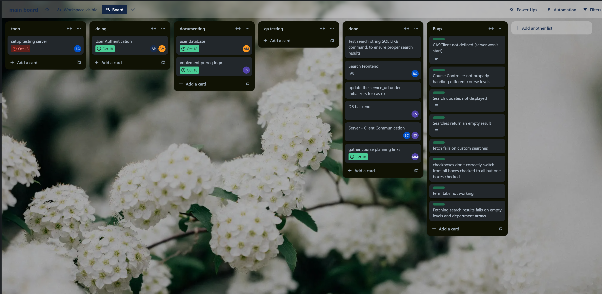
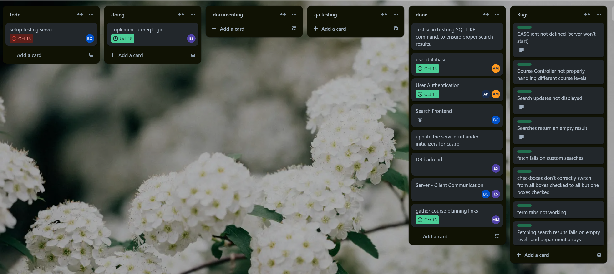

\
A course planner for undergrads at SFU. A group project for CMPT 276 D300, Fall 2024

## Iteration 1 Features ##
- Filtered search with options
- Search by SQL
- Sign in (with autofill if possible) (postponed)
- Server-side state storage when signed in (postponed)

## New Features in Iteration 2 ##
- Courses displayed in the search are now from the actual sfu database
    - Data shown in the search results represent actual courses from the SFU API
- Login functionality
    - The user can sign in with a username and password
    - The user can sign up with a username and password (of at least 6 characters)
    - The user can sign out
- Search state storage
    - The current search state is stored to the server if the user is currently signed in
- Course planning link list
    - Links to course planning resources can be found for all departments nicely organized
- User can now set their grades for selected courses
    - Grades are stored to the user database
    - Grade requirements are applied to the search results when the checkbox to apply selected courses is checked
- Refined search functionality
    - Advanced search now contains 8 SFU departments (CHEM, PHYS, ENSC, CMPT, MATH, MACM, STAT)
    - The user can search by an expanded list of properties

## Cut Features in Iteration 2 ##
- Autofilling courses on sign in
    - No API exists for this
- SFU CAS authentification
    - Removed due to difficulties implementing and loss of autofill feature
- Admin view
    - Removed in favor of testing page and automated prequisite generation
- Extra course and teacher info
    - Removed due to being out of scope for this application
- Filtering by prerequisites
    - Removed due to there being no practical way to tokenize the prerequisite description from SFU API.

## Features Not Yet Implmented in Iteration 2 ##
- Apply prereqs in search
    - A user can store their courses and grades
    - The users information is compared against a tokenized prerequisite logic string
- Search by SQL query
    - The user can enter an SQL query to filter courses with
    - The SQL query is applied to the search
    - Continuation: complete by 11/6
- Find recommended courses
    - Continuation: complete by 11/13
-Sign in feature
    -Sign in and log out still needs to be fixed and updated

## Running The Server Locally ##
### Prerequisites ###
Ruby
NPM

### Install Dependencies: ###
run `bundler install`\
run `npm install`

### Run the Development Server ###
run `ruby bin/rails server` from the main project folder\
navigate to `127.0.0.1:3000` on your browser\

## Iteration 1 Retrospective ##
- What worked:
    - Strong start with research and feasibility, followed by defining requirements
    - Weekly in-person meetings
- What didn't:
    - Working without an initial UI sketch
    - More feasability work would have saved time wasted on cookies
- What to change in iteration 2:
    - Setup github actions to automate testing
    - Make a central development server to reflect the current state of the project and use for debugging
    - Set weekly development targets

## Iteration 2 Retrospective ##
- What went better:
    - Tasks were better allocated to team members
- What we could have improved:
    - More communication with IT services would have saved us a lot of time on CAS and autofill
    - Better deadlines could have improved crunch work
- What we tried to improve from iteration 1:
    - We attempted to solve the final crunch we had in iteration 1 by setting weekly development targets
        - However, as it was in the middle of exams and due to overly ambitious targets, we quickly flew past the first deadline, leading us to fall behind on development.
    - We also spent some time trying to find a development server to run the project on and run github actions, but nothing was found
- What to do moving forward:
    - add final features and polish
    - find host for or host production server ourseleves
    - add documentation for hypothetical maintainence stage (also to prepare for presentations)

## Feature Tracking ##
We used Trello for feature and bug tracking
### Iteration 1: ###
\

### Iteration 2: ###
\

## Top Level Directory Map ##
.
├── app                     # the main code directory
│   ├── assets              # assets used in the app
│   ├── controllers         # handlers for requests
│   ├── models              # defines how data should be stored
│   ├── views               # pages the user can view
│   ├── javascript          # javascript used by webpack to create the html
│   |   ├── components      # react components, stylesheets, and js which are referenced
│   |   └── packs           # entrypoints for webpack
|   ...
├── config
│   ├── routes.rb           # specifies which controllers should be used for requests
│   ├── shakapacker.yml     # shakapacker config (webpack)
|   ├── application.rb      # rails entrypoint
|   ...
├── db                      # database data
├── docs                    # documentation
├── test                    # testing scripts
├── assets                  # assets used in the readme and other documents
├── Rakefile                # file for defining rails tasks
├── Gemfile                 # ruby packages to include
├── package.json            # javascript packages to include
├── babel.config.js         # config for the js transpiler
├── Dockerfile              # config for the production environment
├── postcss.config.js       # config for postcss
├── README.MD
...

## Test results ##
Unit tests were applied for the following cases:

QA testing was used with the following test cases:

search a string in the bar with results
- expected: valid results are shown
- passed: 

search a string in the bar without results
- expected: no results message is shown
- passed: 

search an empty string
- expected: all courses meeting advanced criteria are shown
- passed: 

search a long string
- expected: handled cleanly if request is too long
- passed: 

select a check
- expected: check is set and search updates appropriately
- passed: 

deselect a check
- expected: check is unset and search updates appropriately
- passed: 

select all checks in a category
- expected: search updates appropriately
- passed: 

deselect all checks in a category
- expected: search updates appropriately
- passed: 

toggle the advanced search display
- expected: advanced search shows
- passed: 

spam checks
- expected: checks keep track of their state correctly & search updates correctly
- passed: 

spam the advanced search toggle
- expected: advanced search and toggle continue to operate correctly
- passed: 

add a course
- expected: course is added to correct term tab
- passed: 

remove a course
- expected: course is removed from correct tab
- passed: 

add multiple courses
- expected: all courses are added to their correct tabs
- passed: 

remove all courses
- expected: all courses are removed from their correct tabs
- passed: 

add a duplicate course
- expected: no change to the tabs
- passed: 

spam add courses
- expected: course tabs update appropriately
- passed: 

select a course in a term tab
- expected: course expands to show more info
- passed: 

remove a selected course
- expected: course is removed correctly and other courses can be selected
- passed: 

spam click a course in a tab
- expected: course expands and stays expanded
- passed: 

resize the page
- expected: ui scales reasonably
- passed: 

resize the page with the advanced search open
- expected: advanced search maintains reasonable position on the page
- passed: 